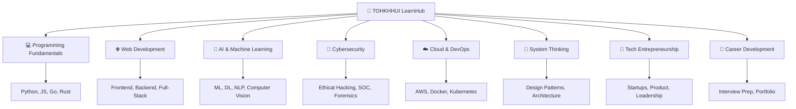
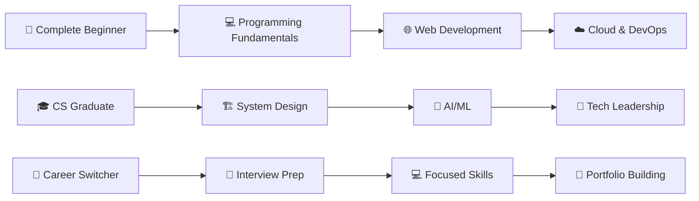

<div align="center">

# 🌟 TOHKHHUI LearnHub 🚀
### *"Build Systems. Master Tech. Grow for Life."*


```ascii
╔══════════════════════════════════════════════════════════════╗
║                                                              ║
║    🎯 Your Complete Tech Career Development Ecosystem 🎯     ║
║                                                              ║
║  💻 Programming • 🌐 Web Dev • 📊 Data Science • 🏗️ Systems  ║
║  🤖 AI/ML • 🔐 Cybersecurity • ☁️ Cloud/DevOps • 🔗 Web3    ║
║  🎬 Animation/VFX • 🎯 Interview Prep • 🚀 Tech Startup     ║
║  🧠 System Thinking • 🧮 Life Codes • 💼 Career Growth      ║
║                                                              ║
╚══════════════════════════════════════════════════════════════╝
```

<p align="center">
  <a href="#-quick-start">🚀 Quick Start</a> •
  <a href="#-learning-paths">📚 Learning Paths</a> •
  <a href="#-community">👥 Community</a> •
  <a href="#-contribute">🤝 Contribute</a>
</p>

---

</div>

## 🎯 Why TOHKHHUI Exists

<table>
<tr>
<td width="50%">

### 💡 **Our Vision**
Building the ultimate **free**, **comprehensive**, and **future-proof** learning ecosystem for tech professionals who think in **systems**, not just tutorials.

</td>
<td width="50%">

### 🔥 **What Makes Us Different**
- ✅ **Free-First Learning** - No paywalls, ever
- ✅ **Roadmap Driven** - Clear career progression
- ✅ **System Thinking Applied** - Deep understanding
- ✅ **Wisdom-Based Code** - Quality over quantity
- ✅ **Long-Term Career Growth** - Sustainable success

</td>
</tr>
</table>

> 💎 *"We don't chase trends. We build strong, durable knowledge stacks that compound over time."*

---

## 🗺️ Learning Ecosystem Map

<div align="center">



</div>

---

## 📚 Learning Paths & Resources

<details>
<summary><h3>🚀 <strong>Core Programming & Development</strong></h3></summary>

| 🌱 **Learning Path** | 📂 **Directory** | 🎯 **Skill Level** | 🔗 **Get Started** |
|:---------------------|:------------------|:-------------------|:---------------------|
| 💻 **Programming Fundamentals** | [`resources/programming/`](resources/programming/) | Beginner → Advanced | [📖 Start Learning](resources/programming/README.md) |
| 🌐 **Web Development** | [`resources/web-development/`](resources/web-development/) | Beginner → Pro | [🚀 Build Apps](resources/web-development/README.md) |
| 📊 **Data Science** | [`resources/data-science/`](resources/data-science/) | Intermediate → Expert | [📊 Analyze Data](resources/data-science/README.md) |
| 🏗️ **System Design** | [`resources/system-design/`](resources/system-design/) | Advanced → Architect | [🏗️ Design Systems](resources/system-design/README.md) |

</details>

<details>
<summary><h3>🤖 <strong>AI & Future Technologies</strong></h3></summary>

| 🧠 **Learning Path** | 📂 **Directory** | 🎯 **Skill Level** | 🔗 **Get Started** |
|:---------------------|:------------------|:-------------------|:---------------------|
| 🤖 **Machine Learning** | [`resources/machine-learning/`](resources/machine-learning/) | Intermediate → Expert | [🧪 Build Models](resources/machine-learning/README.md) |
| 🧠 **Artificial Intelligence** | [`resources/ai/`](resources/ai/) | Advanced → Research | [🤖 Create AI](resources/ai/README.md) |
| 🔗 **Blockchain & Web3** | [`resources/blockchain-web3/`](resources/blockchain-web3/) | Intermediate → Pro | [⛓️ Build DApps](resources/blockchain-web3/README.md) |
| 🎬 **Animation & Creative Tech** | [`resources/animation-vfx/`](resources/animation-vfx/) | Beginner → Pro | [🎨 Create Magic](resources/animation-vfx/README.md) |

</details>

<details>
<summary><h3>🔐 <strong>Security & Infrastructure</strong></h3></summary>

| 🛡️ **Learning Path** | 📂 **Directory** | 🎯 **Skill Level** | 🔗 **Get Started** |
|:---------------------|:------------------|:-------------------|:---------------------|
| 🔐 **Cybersecurity** | [`resources/cybersecurity/`](resources/cybersecurity/) | Beginner → Expert | [🛡️ Secure Systems](resources/cybersecurity/README.md) |
| ☁️ **Cloud & DevOps** | [`resources/cloud-devops/`](resources/cloud-devops/) | Intermediate → Pro | [☁️ Scale Apps](resources/cloud-devops/README.md) |

</details>

<details>
<summary><h3>💼 <strong>Career & Business</strong></h3></summary>

| 🎯 **Learning Path** | 📂 **Directory** | 🎯 **Skill Level** | 🔗 **Get Started** |
|:---------------------|:------------------|:-------------------|:---------------------|
| 🎯 **Interview Preparation** | [`resources/interview-prep/`](resources/interview-prep/) | All Levels | [💪 Ace Interviews](resources/interview-prep/README.md) |
| 🚀 **Tech Entrepreneurship** | [`resources/tech-startup/`](resources/tech-startup/) | Intermediate → Founder | [💡 Build Startups](resources/tech-startup/README.md) |
| 🧠 **System Thinking** | [`resources/system-thinking/`](resources/system-thinking/) | Advanced → Mastery | [🎯 Think Systems](resources/system-thinking/README.md) |
| 🧮 **Life Codes (Wisdom)** | [`life-codes/`](life-codes/) | Philosophical | [💎 Code Wisdom](life-codes/README.md) |

</details>

---

## 🛠️ Developer Tools & Automation

<div align="center">

| 🔧 **Tool** | 📄 **Script** | 🎯 **Purpose** | 🚀 **Action** |
|:------------|:--------------|:---------------|:---------------|
| 🛠️ **Life Codes Generator** | `setup_life_codes.sh` | Auto-generate wisdom modules | [⚙️ Run Script](setup_life_codes.sh) |
| 🩺 **Repository Health Check** | `repo_health_check.sh` | Validate repo structure & links | [🔍 Check Health](repo_health_check.sh) |
| 📊 **Progress Tracker** | `progress_tracker.py` | Track learning milestones | [📈 Track Progress](tools/progress_tracker.py) |
| 🤖 **Auto-Documentation** | `auto_docs.py` | Generate README files | [📝 Generate Docs](tools/auto_docs.py) |

</div>

---

## 🚀 Quick Start

<table>
<tr>
<td width="33%">

### 1️⃣ **Clone & Explore**
```bash
git clone https://github.com/ZeroHack01/Tohkkhui-Learning-Hub.git
cd Tohkkhui-Learning-Hub
```

</td>
<td width="33%">

### 2️⃣ **Choose Your Path**
Pick a learning path from the [ecosystem map](#-learning-ecosystem-map) above that matches your career goals.

</td>
<td width="33%">

### 3️⃣ **Start Building**
Follow the roadmaps, build projects, and join our community for support!

</td>
</tr>
</table>

<div align="center">

### 🎯 **Recommended Learning Sequences**



</div>

---

## 🌟 Core Philosophy

<div align="center">

| 🎯 **Principle** | 💡 **Application** |
|:-----------------|:-------------------|
| **🏗️ Build Systems, Not Tutorials** | Focus on understanding patterns, architectures, and reusable knowledge |
| **⏰ Longevity Over Hype** | Choose technologies and skills that have staying power |
| **🎯 Deep Work & Discipline** | Quality learning requires focused, sustained effort |
| **📈 Compound Career Growth** | Small consistent improvements create exponential results |
| **🧠 System Thinking First** | Understand how pieces fit together before diving deep |

> 💎 *"Long-term thinkers always win the tech game. We're not here for quick fixes—we're building sustainable tech careers."*

</div>

---

## 📖 Documentation Hub

<div align="center">

| 📚 **Document** | 🎯 **Purpose** | 👥 **Audience** |
|:----------------|:---------------|:-----------------|
| [🧭 **Maintainer Handbook**](MAINTAINER_HANDBOOK.md) | Complete guide for maintaining this ecosystem | Maintainers & Core Contributors |
| [🤝 **Contributing Guide**](CONTRIBUTING.md) | How to contribute effectively to the project | All Contributors |
| [🚦 **Code of Conduct**](CODE_OF_CONDUCT.md) | Community standards and behavior guidelines | Everyone |
| [🏗️ **Repository Structure**](repo_structure.md) | Detailed breakdown of directory organization | New Contributors |
| [📊 **Roadmap & Milestones**](ROADMAP.md) | Future plans and development timeline | Community & Stakeholders |
| [📝 **License (MIT)**](LICENSE) | Legal usage terms and permissions | Legal & Commercial Users |

</div>

---

## 🏆 Stats & Achievements

<div align="center">


### 📊 **Repository Metrics**


</div>

---

## 👥 Community & Support

<div align="center">

### 🤝 **Join Our Learning Community**

| 🌐 **Platform** | 🎯 **Purpose** | 🔗 **Link** |
|:----------------|:---------------|:-------------|
| 💬 **Discord** | Real-time chat, study groups, mentorship | [Join Server](https://discord.gg/tohkhhui) |
| 🐦 **Twitter** | Updates, tech insights, community highlights | [@TohkhhuiHub](https://twitter.com/tohkhhuihub) |
| 📧 **Newsletter** | Weekly curated resources and career tips | [Subscribe](mailto:subscribe@tohkhhui.dev) |
| 🌟 **GitHub Discussions** | Q&A, feature requests, knowledge sharing | [Start Discussion](https://github.com/ZeroHack01/Tohkhhui-Learning-Hub/discussions) |

### 🎯 **Ways to Contribute**

<table>
<tr>
<td align="center" width="25%">

**📝 Content**
<br>Add resources, tutorials, or learning paths

</td>
<td align="center" width="25%">

**🐛 Bug Reports**
<br>Find and report issues or broken links

</td>
<td align="center" width="25%">

**💡 Ideas**
<br>Suggest new features or improvements

</td>
<td align="center" width="25%">

**🤝 Mentorship**
<br>Help others in their learning journey

</td>
</tr>
</table>

</div>

---

## 🙏 Credits & Acknowledgments

<div align="center">

### 🌟 **Special Thanks To**

| 🎯 **Category** | 👥 **Contributors** |
|:----------------|:--------------------|
| 📖 **Open-Source Educators** | All the amazing creators who share knowledge freely |
| 🌍 **Global Contributors** | Community members who help improve this resource |
| 🔬 **Knowledge Sharers** | Researchers, developers, and practitioners |
| 🏗️ **Builders** | Everyone building the future of tech education |
| ⭐ **You** | For being part of this learning journey! |

### 💝 **Powered By**


</div>

---

## 🚀 Maintained By

<div align="center">

### 👨‍💻 **Lead Maintainer**

<table>
<tr>
<td align="center" width="100%">
<a href="https://github.com/ZeroHack01">

<br>
<sub><b>@ZeroHack01</b></sub>
</a>
<br>
<i>🚀 Founder & Lead Developer</i>
<br>
<a href="https://twitter.com/zerohack01">🐦 Twitter</a> •
<a href="https://linkedin.com/in/zerohack01">💼 LinkedIn</a> •
<a href="mailto:zerohack01@tohkhhui.dev">📧 Email</a>
</td>
</tr>
</table>

### 🎯 **Project Status**


</div>

---

## ⭐ Show Your Support

<div align="center">

### 🌟 **If you find this project valuable:**

<table>
<tr>
<td align="center" width="25%">

**⭐ Star**
<br>Star this repository

</td>
<td align="center" width="25%">

**🍴 Fork**
<br>Fork and customize

</td>
<td align="center" width="25%">

**📢 Share**
<br>Tell others about it

</td>
<td align="center" width="25%">

**🤝 Contribute**
<br>Add your expertise

</td>
</tr>
</table>

### 💡 **"Knowledge shared is knowledge multiplied"**


</div>

---

<div align="center">


</div>
